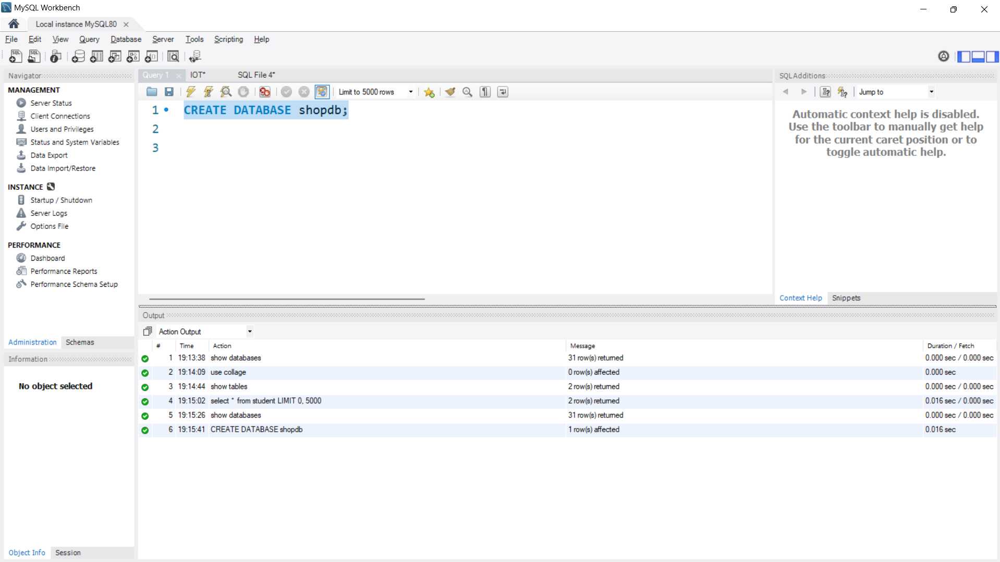
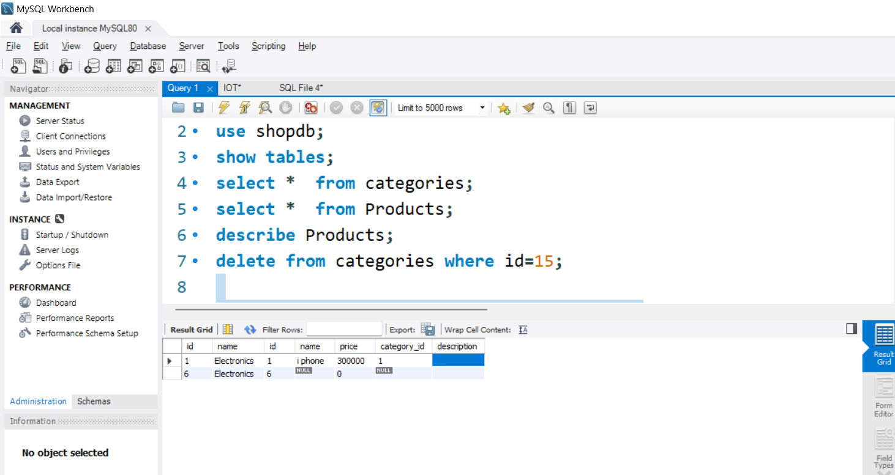
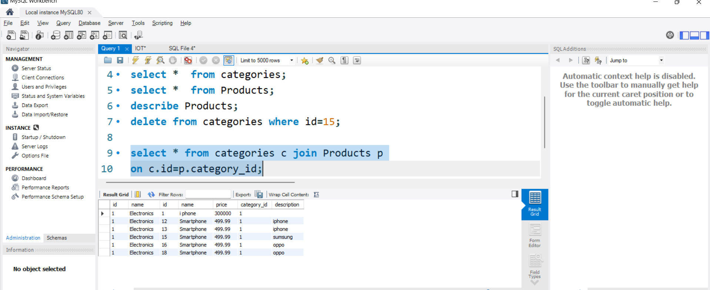
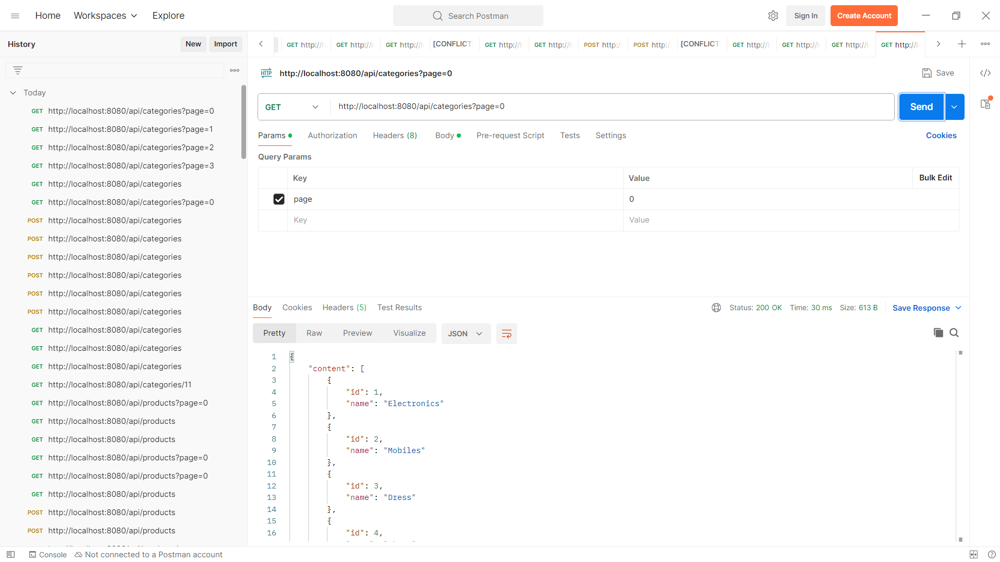
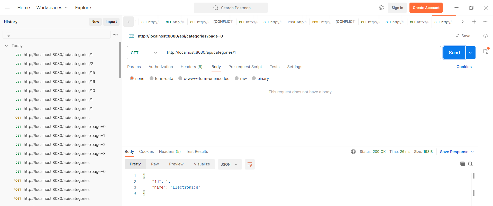
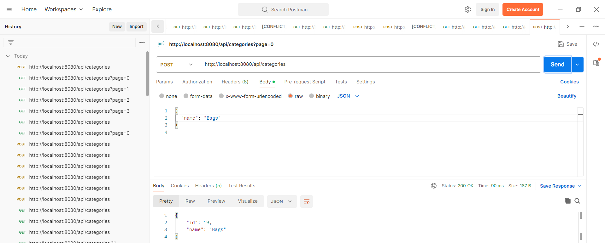
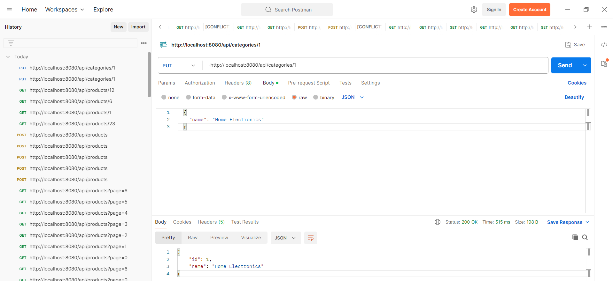
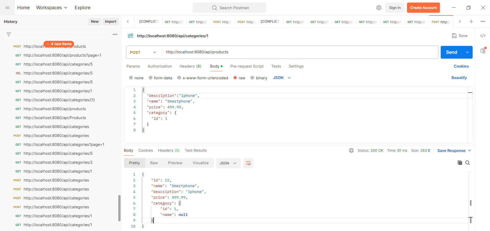
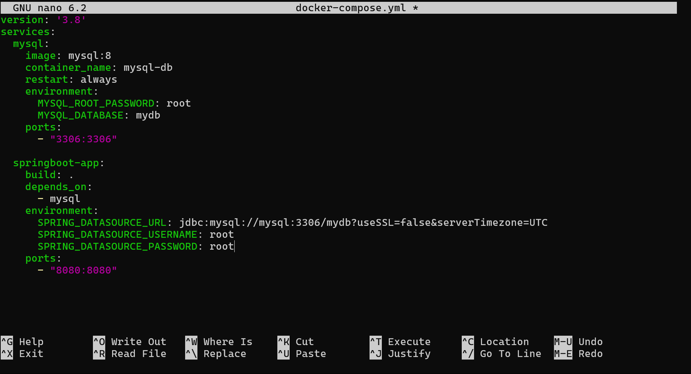
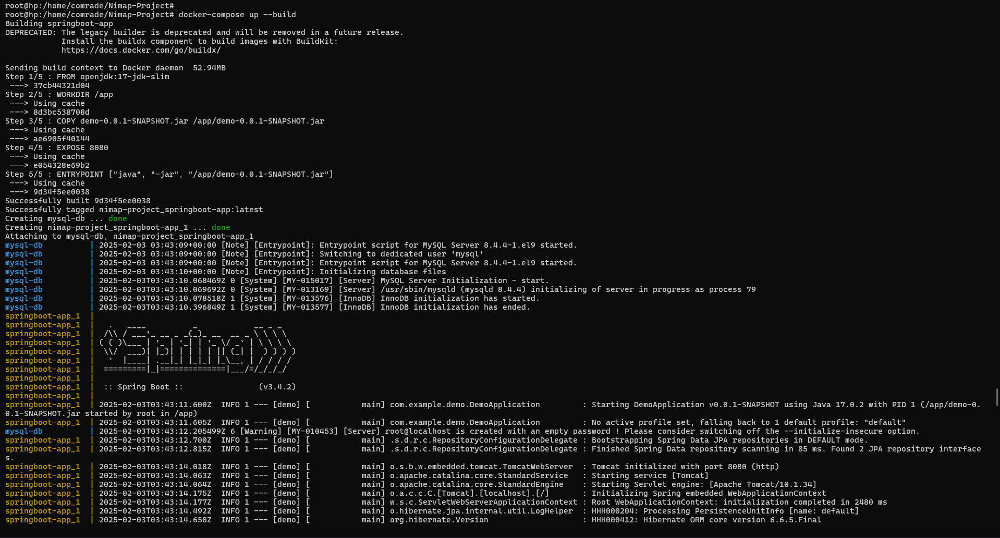

# Nimap-Project


### 1) How Did You Run the Code?

I run the Spring Boot application using two primary methods:

- **Using an IDE (IntelliJ IDEA / Eclipse):**
  1. Open the project in your IDE.
  2. Locate the main application class (e.g., `DemoApplication.java`).
  3. Right-click on the file and select **Run**. This starts the embedded Tomcat server on port 8080.

- **Using Maven Command:**
  1. Open a terminal in the project directory.
  2. Run the command:
     ```bash
     mvn spring-boot:run
     ```
  3. This compiles and runs the project, starting the embedded server.

Once the application is running, you can test the endpoints using Postman or any REST client.

---

### 3) How Did You Run the Machine Test?

I validated the functionality of the APIs through the following steps:

- **Postman API Testing:**
  1. **Category Endpoints:**
     - **GET** all categories: `http://localhost:8080/api/categories?page=0`
     - **GET** a specific category by ID: `http://localhost:8080/api/categories/{id}`
     - **POST** a new category: `http://localhost:8080/api/categories`
     - **PUT** update a category: `http://localhost:8080/api/categories/{id}`
     - **DELETE** a category: `http://localhost:8080/api/categories/{id}`
  2. **Product Endpoints:**
     - **GET** all products: `http://localhost:8080/api/products?page=0`
     - **GET** a specific product by ID: `http://localhost:8080/api/products/{id}`
     - **POST** a new product: `http://localhost:8080/api/products`
     - **PUT** update a product: `http://localhost:8080/api/products/{id}`
     - **DELETE** a product: `http://localhost:8080/api/products/{id}`

  I used Postman to send requests to each endpoint, ensuring the proper CRUD functionality. Additionally, I verified that:
  - **Server-side pagination** is working by using the `page` parameter.
  - **Category-Product relationship** is properly maintained; for example, when retrieving a product, the response includes the associated category details.


    ```bash
    mvn test
    ```
### Some Images To My Work

**Create a Database shopdb**









**Api Call ->> http://localhost:8080/api/categories?page=0**



**GET Api Call ->>http://localhost:8080/api/categories/{id}**



**POST Api Call ->>http://localhost:8080/api/categories**


**UPDATE Api Call ->> http://localhost:8080/api/categories/{id}**


**DELETE Api Call ->> http://localhost:8080/api/categories/{id}**


**Product POST ApiCall -->> http://localhost:8080/api/products**



**You Can Run The Project On Docker Using Dcoker Compose File**






### 4) DB Design

I used a relational database (MySQL) with the following design:

- **Database:** `shopdb`
- **Tables:**

  **a) `categories` Table:**
  - **id** (Primary Key, auto-increment)
  - **name** (VARCHAR)

  **b) `products` Table:**
  - **id** (Primary Key, auto-increment)
  - **name** (VARCHAR)
  - **price** (DOUBLE)
  - **category_id** (Foreign Key referencing `categories.id`)

- **Relationship:**
  - **One-to-Many:** One category can have multiple products.
    - The `Category` entity is mapped to a list of `Product` entities.
    - The `Product` entity includes a reference to its `Category` via a foreign key (`category_id`).

Below is a simple ER diagram for the design:

```
+----------------+         +------------------+
|   categories   |         |     products     |
+----------------+         +------------------+
| id (PK)        |1      * | id (PK)          |
| name           |---------| name             |
+----------------+         | price            |
                           | category_id (FK) |
                           +------------------+
```

- **JPA/Hibernate Annotations:**
  - In the `Category` class, the `@OneToMany(mappedBy = "category", cascade = CascadeType.ALL)` annotation defines the one-to-many relationship.
  - In the `Product` class, the `@ManyToOne` annotation with `@JoinColumn(name = "category_id")` sets up the foreign key association.
 
    
### 4)Docker and Jenkins
I have also added **Docker** and **Jenkins** support to automate deployment. The **Dockerfile** allows the Spring Boot application to be containerized, making it easy to deploy anywhere. The **docker-compose.yml** file helps spin up the application along with a MySQL database in a single command. Additionally, the **Jenkinsfile** automates the CI/CD pipeline, ensuring that the application is built, tested, and deployed using Jenkins. This integration makes the application scalable, portable, and easy to manage in production environments. 
